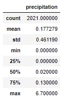

# Surfs_Up

## Project Overview 
Given the task to run analytics on a weather data set to determine the amount of tourist traffic that a newly established business in the state of Hawaii would receive. The data set is based on temperatures and precipitation within a given range of years from multiple weather station locations on the main island of Oʻahu. 

## Resources 
  - Data Source(s): hawaii.sqlite
  - Software: Conda 4.8.3, Python 3.7.7, Flask 1.1.2

## Summary - Deliverables:
### Exploratory Climate Analysis: 
  - Last 12 months of Precipitation:
 

 
  - Summary Statistics of Precipitation Data:

  - Available weather stations within data set: 9 Stations
  - Calculating Lowest, Highest, and Average Temperatures from Most Active Weather Station (USC00519281): 
    - Min. Temp: 54°F
    - Max. Temp: 85°F
    - Average Temp: 71°F
  - Last 12 Months of Temperature Observation Data for Most Active Weather Station
  
  

## Challenge Overview 
Requested to perform further analysis by determining the weather variables between summer and winter seasons. 

## Challenge Summary

### Key Differences: 
  - June Statistical Data: 

  
  
  - December Statistical Data: 

Retrieved the statistical data for the months of June and December across all years within the given data set to represent the peaks of summer and winter seasons. 

Overall, June had a maximum temperature of 85°F and minimum temperature of 64°F versus December’s maximum temperature of 83°F and minimum temperature of 56°F. The standard deviation for temperature for both June and December are close – 3.25°F and 3.74°F respectively – meaning stable temperature ranges are maintained for each season. 

In regard to precipitation, December has a max of 6.42 inches and average of .21 inches, and June has a max of 4.43 inches and average of .13 inches, in which the winter season would have more rain that would slow down tourism and business. 

### Recommendation(s) for Further Analysis: 

  - Extending the date range for statistical data from a singular month to the 3 months within a season, such as June, July, August for summer, and December, January, February for winter.
  - Focusing on the station data that are located near possible spots that the business will be located at and comparing the data to see if there are any significant changes. 
  - Performing analysis on the closest date ranges that have the least amount of rainfall and highest temperatures that may or may not fall within or between the summer and winter months. By discovering this, it could give a better view of the total range of months when the business would be sustainable with the most customers and when to expect declines when said range of months ends. 
